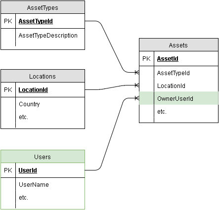

# Part 4 - Upgrading the SQL Server Database

In [Part 3](part-3.md) we saw different ways of running the image we built in [Part 2](part-2.md), which packaged the Dacpac we generated in [Part 1](part-1.md). By using the Dacpac to deploy the database, we can support many scenarios using the same Docker image, and we also have a path in place to upgrade the database schema in a consistent and reliable way.

## Changing the Database schema

Databases evolve as the apps they support evolve - new tables are added, columns are dropped, column definitions change. You can use [change scripts](https://www.infoq.com/articles/db-versioning-scripts) to incrementally update a schema, but with static scripts the target database needs to be in the expected state. If the target database [drifts](https://www.simple-talk.com/blogs/tackling-the-problem-of-database-version-drift/), then the change scripts may fail or behave unexpectedly.

SQL Server's Dacpac approach is much cleaner. It contains a model of the desired state of the schema, and you use the SqlPackage tool to generate the change scripts for a target database immediately before you apply them, so the upgrade will always be from the current state to the desired state. 

In this lab we use the Dacpac to underly the fundamental components for a CI/CD pipeline for database upgrades. We just need to change the source code, rebuild and redeploy. I've added a new `Users` table to the schema, and modified some of the columns in the `Assets` table:



To build a new database image, we first need to run the builder to generate an updated Dacpac with the latest schema model. This is the same command from [Part 1](part-1,md):

```PowerShell
docker run --rm -v $pwd\out:c:\bin -v $pwd\src:c:\src assets-db-builder
```

That updates the Dacpac file in the `out` directory, so we can build a new database container with the updated package. This is the same command from [Part 2](part-2,md), although I'm using a `v2` tag so I can support multiple image versions:

```PowerShell
docker build -t assets-db:v2 --no-cache .
```

> Note: I'm using the [no-cache](https://docs.docker.com/engine/reference/commandline/build/) option to make sure the latest version of the Dacpac gets picked up and packaged into the new image. That shouldn't be necessary, but in my testing on Windows Server 2016 the new Dacpac wasn't always found, so this forces Docker to build each layer rather than using the cached version.

## Upgrading the Database container

To upgrade the database, we just need to kill the existing database container and spin up a new one from the `v2` image, using the same volume mount as the `v1` container. We can use the same commands from [Part 3](part-3.md), but using the new image tag:

```PowerShell
docker kill assets-db
docker run -d --rm -p 1433:1433 --name assets-db --ip $ip -v C:\databases\assets:C:\database assets-db:v2
```

When the container starts, it runs the same initialization script - finds the existing database files, attaches them, and runs the upgrade process to bring the database up to the desired state. The container retains the upgrade script which `SqlPackage` generates, so we can copy it out of the container into the local machine and see the exact SQL statements that were used in the upgrade:

 ```PowerShell
 docker cp assets-db:/init/create.sql .
 ```

 In my case, the upgrade script generated by `SqlPackage` is 150+ lines of SQL, containing the DDL to update the schema, and the DML post-deployment scripts, to insert reference data. The DDL includes the table changes and the new table, as in this snippet:

 ```SQL 
ALTER TABLE [dbo].[Assets] ALTER COLUMN [AssetDescription] NVARCHAR (500) NULL;
GO

ALTER TABLE [dbo].[Assets]
    ADD [OwnerUserId] INT NULL;
GO

PRINT N'Creating [dbo].[Users]...';
GO

CREATE TABLE [dbo].[Users] (
    [UserId]     INT           IDENTITY (1, 1) NOT NULL,
    [FirstName]  NVARCHAR (50) NULL,
    [LastName]   NVARCHAR (50) NULL,
    [LocationId] INT           NULL,
    [UserName]   NVARCHAR (50) NOT NULL,
    PRIMARY KEY CLUSTERED ([UserId] ASC)
);
GO
```

If you repeat those steps to kill the existing database container and create a new one using the same Docker volume, the upgrade script won't have any DDL changes the next time round. The schema has already been upgraded, so it matches the model in the Dacpac. Only the DML scripts with the `INSERT` statements will be in the generated SQL script.

## Conclusion

Docker containers are equally well suited to stateful workloads like databases, as they are stateless workloads like Web servers. The Docker platform supports integration between the container and the host at the network level, so consumers can connect to your database as though it were running in a dedicated machine. And the platform supports integration at the data level with many different storage providers, so you can persist your database files outside the running container, in highly-available shared storage.

SQL Server's Dacpac model is a perfect mechanism for creating a packaged Docker image which contains the database schema and reference data scripts, but not the actual data files. In this lab we saw how to create a database image with a packaged Dacpac which can be used in dev, QA and production environments. We also saw how to use the builder pattern with MSBuild to create the database image. This is the foundation for a database CI/CD pipeline which you can use to build, deploy and run SQL Server databases using Docker on Windows - without needing Visual Studio, MSBuild or SQL Server installed on your machines.